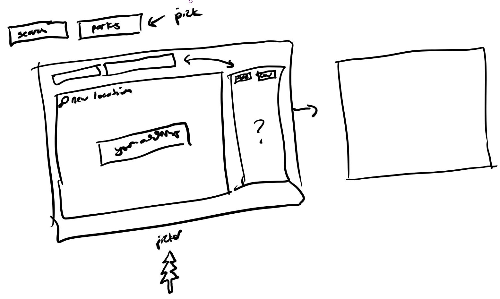
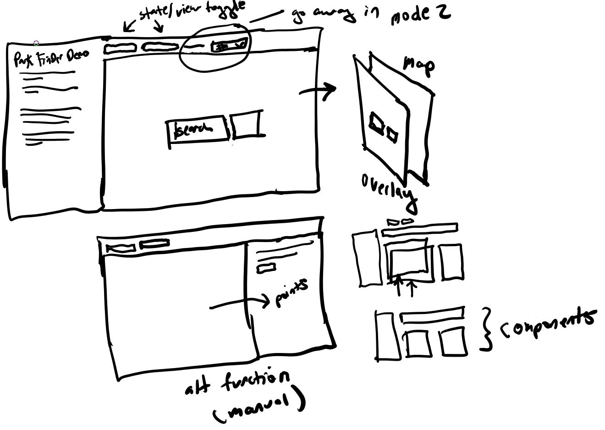

##### 01/19/2020
So I just realized I got the git structure wrong on this site... I need to use git submodules in order to have sub repos inside the main one.
It really only matters due to the separate branches(intended for a project not all sub-repos).

I'm going to rewrite the app mostly from scratch(other than layout/css). Easier than refactoring seems.

##### 01/16/2020
Going to start refactoring... initial design sketch below for first version
The refactor isn't changing the functionality just code so the pieces have their own state management vs. a global one

These are my current thoughts on the component structure

##### 01/14/2020
Limit of 20 for results
Need to look into how to add/stack ontop of exisitng results based on increased radius... not sure how accurate maybe API tier